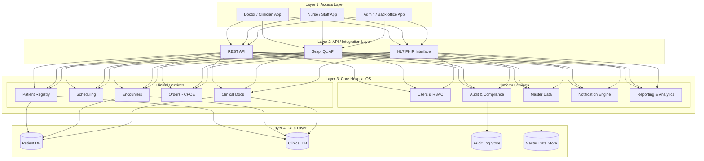

# MedFlow Hospital HIS - Layered Component Diagram

**Version:** 1.0  
**Last Updated:** October 26, 2023

---

## Layered Architecture Diagram

```mermaid
graph TD
    subgraph Layer1["Layer 1: Access Layer"]
        A1[Doctor / Clinician App]
        A2[Nurse / Staff App]
        A3[Admin / Back-office App]
    end

    subgraph Layer2["Layer 2: API / Integration Layer"]
        B1[REST API]
        B2[GraphQL API]
        B3[HL7 FHIR Interface]
    end

    subgraph Layer3["Layer 3: Core Hospital OS"]
        subgraph Clinical["Clinical Services"]
            C1[Patient Registry]
            C2[Scheduling]
            C3[Encounters]
            C4[Orders - CPOE]
            C5[Clinical Docs]
        end
        subgraph Platform["Platform Services"]
            P1[Users & RBAC]
            P2[Master Data]
            P3[Audit & Compliance]
            P4[Notification Engine]
            P5[Reporting & Analytics]
        end
    end

    subgraph Layer4["Layer 4: Data Layer"]
        D1[(Patient DB)]
        D2[(Clinical DB)]
        D3[(Audit Log Store)]
        D4[(Master Data Store)]
    end

    A1 & A2 & A3 --> B1 & B2 & B3
    B1 & B2 & B3 --> C1 & C2 & C3 & C4 & C5
    B1 & B2 & B3 --> P1 & P2 & P3 & P4 & P5
    C1 & C3 & C5 --> D1 & D2
    P3 --> D3
    P2 --> D4
```
